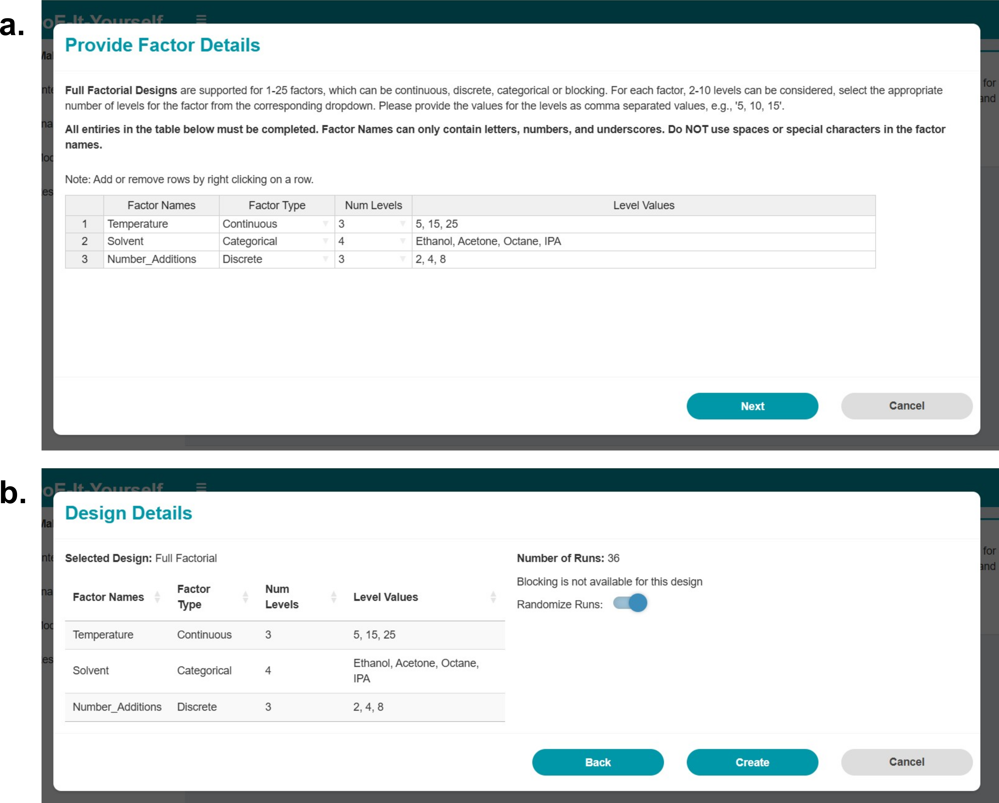

# DoEIY
An Open-Access Web Platform for Democratizing Experimental Design in Chemical and Materials Research

# Introduction

Welcome to DoEIY! This tool helps plan, conduct, and analyse Design of Experiments (DoE) in a structured, accessible, and user-friendly way. It guides the user from creating a design through model fitting and analysis, and on to visualising results and optimising responses. No software installation is needed, only an internet connection. This guide provides clear explanations of key DoE concepts along with step-by-step instructions.

# DoEIY Overview

  
*Overview of the DoEIY software workflow. 1. Make a Design: users select a design type, define factors, and generate the experimental design. 2. Enter/Edit Results: experimental responses are entered directly into the editable design table, with options to save or load designs. 3. Analyze the Design: users select or create custom models; the model summary and statistics as well as design diagnostics are presented. 4. Explore the Design: interactive visualisation of factor–response relationships and optimisation and prediction tools allow users to identify factor settings that maximise, minimise, or achieve a target response.*

The DoEIY software comprises 5 modules or tabs; these can found in the navigation bar on the left (see figure above):

- **Make a Design**
- **Enter/Edit Results**
- **Analyze the Design**
- **Model Explorer**
- **Resources & References**

This layout mirrors the natural progression of a DoE; first you create an experimental design based on your needs, then you carry out the experiments and record your results, next you fit and assess a model, and finally, you use the model as needed (e.g. to maximise a response, understand how different experimental conditions impact the response). When you launch the webapp, you will land on the **Make a Design** tab. You can click on any of the other tabs in the navigation bar on the left to navigate to one of the other sections.

**Note: The software will time-out after 30 minutes of inactivity. DoEIY doesn't store any information between sessions so be sure to save your design to continue working on it later.**

# Make a Design

The first step in the DoE process is to Make a Design. You begin by selecting a design from the dropdown menu:

  
*Make a Design. The Make a Design page in DoEIY, where you select a design type from the dropdown menu and enter the factor details to create a design.*

There are a selection of design types and designs within them; you should choose what design type you need based on what you want to accomplish. The available designs are outlined in this section below.

Once you have chosen your design and click **Make Design**, a pop-up window will appear (see figure below), where you will enter the factor details. The necessary factor details will depend on the chosen design. Factors can be added or removed by right-clicking on the table and selecting the relevant option. After clicking **Next**, you will be taken to the design details. If there are issues with the factor entries, the software will highlight the problems before allowing you to proceed. Once valid factor details are provided, the design details page will appear, summarising the factors, the number of runs, and the blocking options if available. At this stage, you may also choose whether to randomise the run order (the default is randomised). When you are satisfied, click **Create** and the design will be generated. The completed design will then be available under the **Enter/Edit Data** tab.

**Note:** In v1.0.0 of DoEIY, factor names may only contain letters, numbers, and underscores, i.e. syntactically valid names in R. As such, a valid factor name must:

- contain only letters, digits, underscores, and periods,
- begin with a letter or a period (but not a period followed by a digit),
- not be a reserved word (like `if`, `else`, or `function`).

## Screening Designs

Screening designs are used at the early stage of experimentation when you have many possible active factors, i.e., factors that have an impact on the response(s), but do not yet know which ones are actually important. The goal is to quickly and efficiently identify the few factors that have the biggest influence on the response with the fewest experiments. Once the key factors are identified, you can focus later studies on those factors using more in-depth designs such as factorial or response surface methods. Currently the software offers Plackett-Burman designs for screening.

**Plackett-Burman Designs** are efficient screening tools for identifying which factors are likely to influence while keeping the number of experiments to a minimum. This makes these designs very effective for narrowing down a large set of possible factors to just those that actually affect the response. It is important to note that main effects may be mixed with higher-order interactions, meaning that what looks like a strong factor effect may in fact reflect an underlying interaction. Even so, these designs remain powerful tools for quickly focusing experimental effort on the most influential factors. This software offers Plackett-Burman designs for 4 to 23 factors.

  
*Make a Plackett-Burman Design. a. Factor details window for entering names, types, and two level values in a Plackett–Burman design. b. Design details window showing a summary of factors and runs, with the option to randomise the run order.*

For a Plackett-Burman design, select *Plackett-Burman* from the dropdown menu. In the factor details window you must specify each factor with a name, its type (continuous, discrete, or categorical), and exactly two level values (e.g. `-1, 1`). Once created, the design details will summarise the factors and total number of runs. You may then choose whether to keep the default randomised run order or disable randomisation before finalising the design. Blocking is not available for this design.

## Factorial Designs

Factorial designs provide a structured way to study how multiple factors influence a response, both individually and in combination allowing you to estimate not only the main effects of each factor but also their interactions. This is important as in many real systems, the effect of one factor can depend on the level of another. Importantly, 2-level factorial designs are limited to estimating linear effects and interactions; they do not capture curvature in the response (e.g., quadratic effects). The software supports both full and fractional factorial designs.

**Full Factorial Designs** investigate every possible combination of factor levels, using two or more levels for each factor. This comprehensive approach enables the independent estimation of all main effects and higher-order interactions, providing a complete understanding of factor relationships. This makes these designs ideal when the number of factors is small or resources allow for a larger number or runs. DoEIY provides full factorial designs for up to 25 factors with a maximum of 10 levels per factor.

  
*Make a Full Factorial Design. a. Factor details window for specifying names, types, number of levels, and level values in a full factorial design. b. Design details window summarising the factors and the total number of runs, with the option to randomise the run order.*

**Fractional Factorial Designs** are efficient alternatives to full factorial designs, utilising only a fraction of the total possible runs. They allow for the estimation of main effects and, depending on the design's resolution, certain interactions. The resolution of a fractional factorial design indicates which types of effects are aliased with which. This software provides 2-level fractional factorial designs with the following resolutions:

- Resolution III – main effects are not aliased with each other but may be aliased with two-factor interactions.
- Resolution IV – main effects are not aliased with other main effects or two-factor interactions; two-factor interactions may still be aliased with each other.
- Resolution V – two-factor interactions are not aliased with main effects or other two-factor interactions, but may be aliased with three-factor interactions.

  
*Make a Fractional Factorial Design. a. Factor details window for entering names, types, and two level values in a fractional factorial design. b. Design diagnostics window with dropdown menus to select the total number of runs and the number of blocks, plus the option to randomise.*

Resolution III designs are generally suitable for screening studies, when the primary goal is simply to flag potentially important factors. Resolution IV is often considered the minimum acceptable for most studies, as it provides clearer estimation of main effects. Resolution V is preferred when interactions are expected to be important and you want confidence in interpreting both main and two-factor effects. Increasing the resolution provides clearer interpretation, but at the cost of a higher experimental workload. Selecting the appropriate resolution depends on balancing the level of detail you need against the number of runs that can be executed.

For a fractional factorial design, select *Fractional Factorial* from the dropdown menu. In the factor details window you must provide a name, type, and level values for each factor. Only two levels are permitted, entered as comma-separated values (e.g. `-1, 1`). After completing the factor details, the design details page will appear. Here, the first dropdown menu lets you select the total number of runs for the fractional factorial design, this number is always a power of 2. Based on your selection, the second dropdown menu will update to show the number of blocks the design can accommodate. You can then choose the appropriate number of blocks from the available options before finalising the design. As with the other designs, you can choose whether to randomise the order of the experimental runs.

## Response Surface Designs

Response surface designs are used when you need to explore non-linearity in the relationship between factors and the response(s). They use more than two levels for each factor, allowing for the estimation of quadratic effects for modelling curvature in the response(s). While a 3-level full factorial design can provide this information, response surface designs are typically more efficient, needing fewer experimental runs to achieve the same insight.

**Box-Behnken Designs** are response surface designs that use 3 levels for each factor to efficiently estimate quadratic models. They allow independent estimation of main effects, two-factor interactions, and quadratic effects, without requiring the full number of runs of a three-level factorial. In this software, Box–Behnken designs are available for experiments with 3 to 7 factors.

  
*Make a Box-Behnken Design. a. Factor details window for entering names and three equally spaced levels for each continuous factor in a Box–Behnken design. b. Design diagnostics window where blocking can be selected for 4- or 5-factor designs, along with the option to randomise the run order.*

**Central Composite Designs** are response surface designs used to fit quadratic models by employing 3 levels for each factor. They are composed of three parts:

- Factorial Points – a full or fractional factorial design (typically Resolution V) that estimates the main effects and two factor interactions
- Axial Points – a set of points placed along each axis (between or beyond the extremes of the factors) to estimate quadratic effects
- Centre Points – located at the midpoint of all factors; helps improve precision and estimate experimental error, while also preserving orthogonality and rotatability

The positioning of the axial points depends on whether the design is Circumscribed, Inscribed, or Face-Centred.

- Circumscribed – the axial points lie outside the range of the factorial design.
- Inscribed – the axial points lie within the provided upper and lower bounds and the factorial design is "shrunk" to fit within the range to preserve rotatability.
- Face Centred – the axial points lie on the centre of each face of the factorial design. These axial points do not exceed the bounds of the factorial design. This option is not rotatable.

  
*Make a Central-Composite Design. a. Factor details window for specifying names and upper/lower level values for each continuous factor in a Central Composite design. b. Design details window where the design type (circumscribed, inscribed, or face-centred) is selected, with the option to randomise.*

For a Central Composite design, select *Central Composite* from the dropdown menu. In the factor details window you must provide a name and the upper and lower level values for each factor. All factors must be continuous. The software will then calculate the additional levels automatically, based on the type of central composite design selected. In the design details pane, a dropdown menu allows you to choose between the Circumscribed, Inscribed, or Face-Centred variants. Blocking is not available for this design. As with other designs, you may also choose whether to keep the default randomised run order or disable randomisation before finalising the design.

## Space Filling Designs

Space-filling designs are used to explore a wide region of the design space efficiently. The goal is to maximise coverage while ensuring the experimental runs are spread as evenly as possible across the design space. They can be particularly useful when little is known about the system or when machine learning models will be applied. In this software, space-filling designs are implemented through Latin Hypercube sampling.

  
*Make a Latin Hypercube Design. a. Factor details window for entering names, types, and level values in a Latin Hypercube design. b. Design details window for selecting the number of runs, with the option to randomise.*

**Latin Hypercube Sampling** is a statistical method for creating designs that efficiently explore the design space with a set number of runs. Each factor is sampled uniformly across its range, ensuring all portions of the design space are represented. This allows for broad and balanced coverage of the design space with fewer runs than classical designs. This makes Latin Hypercube designs very useful for exploring complex, high-dimensional systems when other designs would require an infeasible number of runs. Note: Because this method incorporates an element of randomness, two designs generated from the same inputs may differ; however, each design is still optimised for balance and coverage.

## Custom Designs

Custom designs are flexible designs that tailor the experimental runs to the specific model you want to fit. Instead of following a fixed template, you define the terms in the model and a custom design is constructed to maximise the statistical information for it. They are particularly useful when you have a mix of factor types, a limited number of runs that can be performed, or other restrictions that render classical designs unsuitable. DoEIY offers custom designs using the D-Optimal methodology.

**D-Optimal Designs** are built around a specified model that includes the effects and interactions you wish to estimate. You specify which model terms to include (main effects, interactions, quadratic terms, or custom combinations), and the D-Optimal algorithm will generate a set of runs optimised to estimate those terms as efficiently as possible. This software supports D-Optimal designs for any number of factors, levels, and factor types, including continuous, discrete, categorical, and blocking factors.

  
*Make a D-Optimal Design. a. Factor details window for entering names, types, and level values in a D-optimal design. b. Design details window for selecting model components (e.g. main effects, two-factor interactions, quadratics) and any custom interactions.*

# Entering and Editing Results

Once you have finalised your experimental design, the **Enter/Edit Results** tab will display the design matrix in an editable table:

  
*Enter/Edit Results. The Enter/Edit Results tab, where you can enter responses, save or load designs, and edit rows or columns in the design matrix.*

You can type your measured responses directly into the table. For example, if your response is yield, particle size, or another experimental measurement, simply enter the values in the appropriate response column next to the corresponding run.

## Saving and Loading Designs

- The **Save** button stores your design and its factor metadata in a `.csv` file. This file can later be reloaded to continue your work.
- The **Load** button restores a previously saved design into the table for further editing or analysis.

**Important:** The DoEIY webapp does not auto-save and will time out after 30 minutes of inactivity. To avoid losing your work, save your progress frequently.

## Editing the Table

When a design is loaded, additional editing options appear:

- **Remove Column** – deletes a column from the table.
- **Add Column** – creates a new column.
- **Update Column** – allows you to change a column's name, type, or position.

For editing rows, right-click on any row to open the context menu:

- **Insert above** – add a new row directly above the selected one.
- **Insert below** – add a new row directly below the selected one.
- **Remove** – delete the selected row.

This editing functionality allows you to flexibly manage your dataset as you collect experimental results.

# Analyze the Design

Once responses have been entered, you can move to the **Analyze the Design** tab. This tab contains three subtabs: **Create Model**, **ANOVA**, and **Design Diagnostics**.

  
*Analyze the Design. The Analyze the Design tab, which contains the Create Model, ANOVA, and Design Diagnostics subtabs.*

## Create Model

In this subtab you specify the structure of the statistical model. You can choose one of the default model structures:

- **Main Effects** – includes only the main factors.
- **Main Effects + Interactions (2-way)** – includes main factors and all two-factor interactions.
- **Response Surface** – includes main factors, two-factor interactions, and quadratic terms.

Click **Apply** to populate the model term list. You may also build a custom model by using **Add**, **Remove**, or **Cross**.

Next, select the response variable you wish to model and click **Analyze**. This fits the model and moves you automatically to the ANOVA subtab.

*How the model is fitted:* Models are fitted by ordinary least squares regression using R's `aov()` function. ANOVA is then applied to partition variance and test the significance of the terms.

  
*Model Specification. The Create Model subtab, showing the default-model dropdown, model term lists, and controls for adding, removing, or crossing terms.*

## ANOVA

The **ANOVA** subtab reports model fit and term significance. Outputs include:

- A **parity plot** (predicted vs. observed values).
- Summary metrics: $R^2$, adjusted $R^2$, the $F$-statistic, and the overall $p$-value.
- An **ANOVA table** listing degrees of freedom, sum of squares, mean square, $F$-statistic, and $p$-values.
- An **Estimates table** showing coefficients, standard errors, $t$-statistics, and $p$-values.

  
*ANOVA Results. The ANOVA subtab, showing the parity plot, model fit metrics, and excerpts from the ANOVA and Estimates tables.*

## Design Diagnostics

The **Design Diagnostics** subtab provides tools to evaluate the quality of the fitted model.

- **Alias structure:** identifies terms that cannot be distinguished due to the design.
- **Correlation heatmap:** visualises collinearity among model terms.

  
*Diagnostics. The Design Diagnostics subtab, showing an alias report and a correlation heatmap.*

# Model Explorer

The **Model Explorer** tab allows you to interact with your fitted model. It contains two subtabs: **Visualizer** and **Interact**.

## Visualizer

The **Visualizer** subtab displays plots of the response against each factor. Sliders allow you to adjust factor values interactively.

  
*Factor-Response Visualizer. The Visualizer subtab, showing factor-response plots with sliders and a predicted response read-out.*

## Interact (Optimisation and Targeting)

The **Interact** subtab lets you optimise or target a response value.

- Choose a goal: **Maximise**, **Minimise**, or **Find Target**.
- For **Find Target**, enter the target response value.
- Optionally provide starting values for the factors.
- Click **Run** to obtain factor settings and the predicted response.

  
*Interact Optimisation. The Interact subtab, showing goal selection, optional starting values, and the returned solution.*

# DoE Glossary

Before using DoEIY, it is helpful to review some core DoE terminology:

- **Factors** are the variables you choose to study and deliberately control.
- **Levels** are the values for each factor that are investigated.
- The **Design Space** is the multi-dimensional region defined by the factors.
- A **Response** is the measured output(s) of interest.
- **Blocking** is a way to group experimental runs to account for known variability.
- An **Interaction** is when the effect of one factor depends on another.
- A **Run** is a single execution of the experiment.
- **Aliasing** occurs when effects of two or more factors cannot be distinguished.
- **Correlation** describes how strongly two model terms vary together.
- **ANOVA** partitions total variability to test significance of terms.
- **Rotatability** ensures prediction precision depends only on distance from the centre.
- **Orthogonality** ensures estimates of model terms are uncorrelated.

[^1]: Corresponding author: <s.guldin@ucl.ac.uk>
